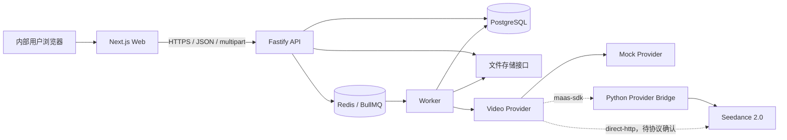

# 系统架构

## 1. 总体关系



浏览器只访问 Web 和内部 API，不直接访问 Provider、Provider Bridge、PostgreSQL、
Redis 或服务器文件路径。AICC 模式下 API Key 仅注入 Python Bridge；未来
`direct-http` 模式若获得完整协议依据，凭据也只能注入 Worker。当前 Mock 和 AICC
Bridge 均已实现，但默认只启用 Mock；真实创建还受 `REAL_API_TEST` 和单次用户授权
双重门保护。

## 2. 组件职责

### Next.js 前端

- 提供创建、任务详情、历史、失败提示、视频预览和下载界面。
- 从 API 获取参数能力与校验规则，不在前端硬编码真实 Seedance 参数。
- 上传参考图片并创建任务；对非终态任务使用退避轮询。
- 仅持有内部任务 ID 和素材 ID，不接触 Provider 凭据或原始响应。

### Fastify API

- 负责 Zod 输入校验、上传授权、任务和历史查询、下载访问控制。
- 将任务写入 PostgreSQL，再以任务 ID 作为 BullMQ `jobId` 幂等入队。
- 不在 HTTP 请求中执行长时间生成任务。
- 提供健康检查；分别报告进程存活与 PostgreSQL/Redis 就绪状态。

### Worker

- 消费 BullMQ 任务，完成 `QUEUED → SUBMITTING → PROCESSING` 流转。
- 通过 `SeedanceProvider` 创建和查询任务，不依赖供应商响应结构。
- 按配置选择 Mock、Python SDK Bridge 或经确认的原生 HTTP transport；不能从 SDK 模式静默降级到明文 HTTP。
- 使用延迟 Job 或受控调度继续轮询；终态后停止轮询。
- 下载 Provider 产物，经校验后写入文件存储，并保存 Asset 与 UsageRecord。
- 用数据库条件更新保护状态，避免并发 Worker 重复推进任务。

### Redis 与 BullMQ

- 保存等待、延迟、重试和执行锁等短期队列数据，不作为业务事实来源。
- 队列 Job 只携带内部 `taskId`，不携带 API Key、完整提示词或二进制素材。
- 使用确定性的 `jobId` 去重。定期协调器检查数据库中长期停留且缺失 Job 的非终态任务并补偿入队。

### Python Provider Bridge（真实机密模型阶段）

- 将私有 Python SDK 封装为仅 Docker 内网可见的窄接口，长期复用 SDK 客户端。
- 独占移动云 API Key、RSA 私钥和 SDK 原始响应，向 Worker 只返回规范化 DTO 或受控文件流。
- 负责机密通道、视频解密、SDK 日志过滤、调用超时和临时文件清理。
- 具体 SDK 行为、配置和待确认协议见 `docs/provider-api.md`。

### PostgreSQL

- 是任务状态、参数、素材元数据、状态事件和用量的唯一事实来源。
- 状态更新与 TaskEvent 在同一数据库事务中完成。
- JSON 只承载尚需适配的 Provider 参数或脱敏快照；可检索核心字段使用明确列。

### 文件存储

- `Storage` 接口至少提供 `put`、`getStream`、`stat`、`delete` 和受控下载能力。
- 开发环境以配置的根目录保存文件，存储键由服务生成并校验，不能由用户拼接路径。
- 数据库只存 `storageKey` 与元数据，不存服务器绝对路径。
- 后续 MinIO/S3 适配保持相同接口，可将下载切换为短期签名 URL。

## 3. 关键数据流

### 创建任务

1. 前端先上传图片，API 校验并写入存储，返回 Asset ID。
2. 前端提交提示词、Asset ID、Provider 名称和参数。
3. API 调用 Provider 的本地参数校验，事务内创建 VideoTask、TaskAsset 和初始 TaskEvent。
4. API 用 `taskId` 幂等入队并返回 `202 Accepted`。若 Redis 短暂失败，任务保留为 `QUEUED`，由补偿器重试入队。

### 执行与查询

1. Worker 锁定任务并按配置调用 Mock Provider 或私有 AICC Bridge；保存 Provider
   任务 ID 后进入 `PROCESSING`。
2. 后续延迟 Job 查询状态并规范化为内部状态。
3. 成功时 Worker 将视频流写入 Storage，再在事务内写入输出 Asset、VideoOutput、
   可用的 UsageRecord 和成功事件。
4. 前端只轮询 API；API 从 PostgreSQL 返回稳定的内部 DTO。

## 4. 推荐目录结构

```text
seedance-console/
├── apps/
│   ├── web/
│   ├── api/
│   └── worker/
├── services/
│   └── provider-bridge/
├── packages/
│   ├── contracts/
│   ├── db/
│   ├── providers/
│   ├── storage/
│   ├── config/
│   └── observability/
├── tests/integration/
├── docs/
├── docker-compose.yml
├── pnpm-workspace.yaml
└── package.json
```

## 5. 核心数据库实体

| 实体          | 关键字段                                                                                                                                 | 作用                                                                         |
| ------------- | ---------------------------------------------------------------------------------------------------------------------------------------- | ---------------------------------------------------------------------------- |
| `VideoTask`   | `id`, `clientRequestId`, `provider`, `providerTaskId`, `status`, `prompt`, `parameters`, `progress`, `errorCode`, `errorMessage`, 时间戳 | 任务聚合根；`clientRequestId` 唯一，`provider + providerTaskId` 在非空时唯一 |
| `Asset`       | `id`, `kind`, `storageKey`, `originalName`, `mimeType`, `sizeBytes`, `checksum`, 时间戳                                                  | 输入图片或输出视频的存储元数据                                               |
| `TaskAsset`   | `taskId`, `assetId`, `role`, `position`                                                                                                  | 任务与素材关联；角色区分参考图片和生成结果                                   |
| `TaskEvent`   | `id`, `taskId`, `fromStatus`, `toStatus`, `reason`, `metadata`, `createdAt`                                                              | 不可变状态审计与排障时间线                                                   |
| `UsageRecord` | `id`, `taskId`, `provider`, `metric`, `quantity`, `unit`, `raw`, `recordedAt`                                                            | 保存 Provider 明确返回的用量；不推算缺失数据                                 |

可选的 `ProviderCall` 仅在确有排障需求时加入，用于保存请求类型、耗时、结果与脱敏摘要，绝不保存密钥、授权头或敏感文件内容。

## 6. 一致性与安全边界

PostgreSQL 与 Redis 无法共享事务，因此采用“数据库为准 + 确定性 Job ID + 补偿协调”的最终一致模型。Worker 每次执行前重新读取状态；终态任务直接返回。真实 Provider 是否支持请求幂等、取消和安全重试，必须以 `docs/provider-api.md` 为准；未确认前不得自动重发结果不明的创建请求。

生产部署只发布 Web/API 入口。PostgreSQL、Redis 和本地存储卷不绑定公网端口；容器以非 root 用户运行，下载响应设置安全的内容类型与文件名。
