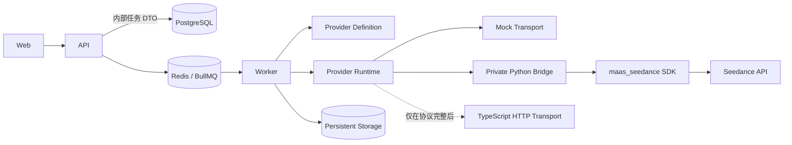

# 真实 Seedance Provider 接入设计

> 本文保留 P2 时的设计背景。对应实现已经完成，并由真实纯文和单参考图 Demo 验证；
> 当前事实状态以
> [真实 Provider Demo 最终检查点](REAL_PROVIDER_DEMO_CHECKPOINT.md) 和
> [分阶段实施记录](REAL_PROVIDER_IMPLEMENTATION_PLAN.md) 为准。

## 1. 目标与边界

本文是 P2 设计归档，不是当前实施状态清单。设计依据来自：

- `docs/provider-api.md` 中 SDK、Demo 和源码已经确认的调用格式。
- `docs/PROVIDER_ADAPTER.md` 的内部隔离原则。
- 当前 `packages/seedance-provider`、API、Worker、Storage、Prisma schema 和任务状态机。

`TODO_CONFIRM` 项不在本文中补猜。未确认的用量、Webhook、远端取消、完整参数范围等非核心能力不阻塞创建、查询、状态映射、视频下载和本地持久化的设计；会改变安全 transport、素材可达性或防重复提交保证的缺口则明确列为 P3 阻断条件。

“本阶段不修改代码、不配置真实 Key、不调用真实接口”是 P2 当时的设计边界；后续
P3/P4 已按双重门完成实现以及纯文和单参考图真实 Demo。

## 2. 设计结论

应用层 Provider 名称只使用：

```text
mock
seedance
```

核心边界：



设计原则：

- `ProviderDefinition` 只包含 capabilities 和本地参数校验，可在 API 中运行，不需要 API Key。
- `ProviderRuntime` 只在 Worker 中创建，拥有网络调用、状态规范化和下载能力。
- Provider 原始字段只存在于 Adapter/transport 内；API、业务 Worker、数据库 DTO 和前端不读取原始响应。
- `providerTaskId` 是创建和轮询之间唯一持久化的远端标识。
- Provider 报告 `succeeded` 不等于内部 `SUCCEEDED`；视频安全写入 Storage 且数据库元数据提交后才进入内部 `SUCCEEDED`。
- 创建操作默认不自动重试；查询和未提交本地结果的下载允许受控重试。
- Mock Provider 保留并实现相同接口，仍是默认 Provider 和自动化测试 Provider。

## 3. 统一 Provider 接口

以下为目标 TypeScript 契约草案。命名可以在 P3 小幅调整，但语义不得弱化。

```ts
type ProviderName = "mock" | "seedance";

type ProviderNormalizedStatus =
  "PROCESSING" | "SUCCEEDED" | "FAILED" | "CANCELLED" | "EXPIRED";

type ProviderAssetRole =
  "REFERENCE_IMAGE" | "REFERENCE_VIDEO" | "REFERENCE_AUDIO";

interface PublishedProviderAsset {
  assetId: string;
  role: ProviderAssetRole;
  position: number;
  mimeType: string;
  sizeBytes: number;
  checksum?: string;
  url: string;
  expiresAt?: Date;
}

interface ProviderCreateInput {
  clientRequestId: string;
  model: string;
  prompt: string;
  assets: readonly PublishedProviderAsset[];
  parameters: Readonly<Record<string, unknown>>;
}

interface ProviderTaskCreated {
  providerTaskId: string;
}

interface ProviderOutputDescriptor {
  kind: "video";
  available: boolean;
}

interface ProviderTaskSnapshot {
  providerTaskId: string;
  status: ProviderNormalizedStatus;
  outputs: readonly ProviderOutputDescriptor[];
  usage: readonly ProviderUsage[];
  error?: ProviderErrorInfo;
  debug?: {
    providerStatus?: string;
    providerRequestId?: string;
  };
}

interface ProviderUsage {
  metric: string;
  quantity: string;
  unit: string;
}

interface ProviderDownload {
  body: NodeJS.ReadableStream;
  contentType?: string;
  contentLength?: number;
  fileName?: string;
}

type ValidationResult<T> =
  | { ok: true; value: T }
  | {
      ok: false;
      issues: readonly {
        path: string;
        code: string;
        message: string;
      }[];
    };

interface ProviderDefinition<TParameters = Readonly<Record<string, unknown>>> {
  readonly name: ProviderName;
  getCapabilities(): Promise<ProviderCapabilities>;
  validateParameters(
    model: string,
    parameters: unknown
  ): ValidationResult<TParameters>;
}

interface ProviderRuntime<
  TParameters = Readonly<Record<string, unknown>>
> extends ProviderDefinition<TParameters> {
  createTask(input: ProviderCreateInput): Promise<ProviderTaskCreated>;
  getTask(providerTaskId: string): Promise<ProviderTaskSnapshot>;
  cancelTask(providerTaskId: string): Promise<ProviderTaskSnapshot>;
  normalizeStatus(rawStatus: unknown): ProviderNormalizedStatus;
  normalizeUsage(rawResponse: unknown): readonly ProviderUsage[];
  downloadOutput(
    providerTaskId: string,
    output: { kind: "video" }
  ): Promise<ProviderDownload>;
}
```

`ProviderTaskSnapshot.debug` 只能包含允许列表中的短字符串；不得放完整 Provider 响应、素材 URL、视频 URL、提示词、Header 或密钥。生产 API DTO 不返回该字段。

### 3.1 方法契约

| 方法                   | 输入                                                    | 输出                   | 主要错误                                                                          | 自动重试                                                                         | 幂等要求                                                             | 日志要求                                                                                 |
| ---------------------- | ------------------------------------------------------- | ---------------------- | --------------------------------------------------------------------------------- | -------------------------------------------------------------------------------- | -------------------------------------------------------------------- | ---------------------------------------------------------------------------------------- |
| `validateParameters()` | 模型 ID、未知参数对象                                   | 规范化参数或字段级问题 | `ProviderValidationError`                                                         | 否，纯函数                                                                       | 相同输入必须产生相同结果                                             | 只记 issue code/path，不记完整提示词或素材                                               |
| `createTask()`         | client request ID、模型、提示词、已发布素材、规范化参数 | `providerTaskId`       | Validation、Authentication、RateLimit、Transient、OutcomeUnknown、Protocol        | 默认禁止；只有已确认的 Provider 幂等机制或本地 Bridge 注册表命中时可返回既有结果 | 必须以 `clientRequestId` 作为本地提交键；远端幂等仍为 `TODO_CONFIRM` | 不记 Authorization、Key、完整 body、提示词、素材 URL；只记 task ID、操作、耗时、结果分类 |
| `getTask()`            | `providerTaskId`                                        | 规范化 snapshot        | Authentication、RateLimit、Transient、NotFound、Protocol                          | 允许对安全 GET 的网络错误、429 和明确可重试 5xx 退避；错误分类仍受协议边界限制   | 天然只读                                                             | 可记哈希/截断后的 task ID、规范化状态、耗时；不记完整响应和视频 URL                      |
| `cancelTask()`         | `providerTaskId`                                        | 规范化 snapshot        | UnsupportedOperation、Conflict、Authentication、OutcomeUnknown                    | 当前 Seedance 禁止自动重试，因为 DELETE 是否可重复及取消语义未确认               | Provider 明确确认前不假定幂等                                        | 只记请求意图和规范化结果，不记原始响应                                                   |
| `normalizeStatus()`    | Provider 原始状态值                                     | Provider 规范状态      | `ProviderProtocolError`                                                           | 不适用，纯函数                                                                   | 是                                                                   | 未知值只允许截断并转义后进入内部调试事件                                                 |
| `normalizeUsage()`     | 已通过最小 schema 的 Provider 响应                      | 明确用量数组           | `ProviderProtocolError`                                                           | 不适用，纯函数                                                                   | 是                                                                   | 当前返回空数组；不得推算 token、费用或单位                                               |
| `downloadOutput()`     | `providerTaskId`、输出种类                              | 可读流及已验证元数据   | Authentication、RateLimit、Transient、OutputExpired、DownloadValidation、Protocol | 在尚未提交本地文件时允许重试安全下载；每次失败清理临时文件                       | 相同远端输出到确定性本地 key；不得创建新生成任务                     | 不记完整 URL、签名参数、响应 body 或解密材料；只记 host 分类、字节数、耗时、校验结果     |

## 4. 错误模型

统一错误基类应携带：

```ts
interface ProviderErrorDetails {
  code: string;
  operation:
    "VALIDATE" | "CREATE" | "GET" | "CANCEL" | "DOWNLOAD" | "NORMALIZE";
  retry: "NEVER" | "SAFE_READ" | "IDEMPOTENT_ONLY" | "MANUAL_RECONCILIATION";
  retryAfterMs?: number;
  providerRequestId?: string;
  safeMessage: string;
}
```

目标错误类型：

| 类型                                | 含义                                 | 默认处理                                         |
| ----------------------------------- | ------------------------------------ | ------------------------------------------------ |
| `ProviderValidationError`           | 内部输入或 Provider 参数无效         | 不重试；创建前返回稳定字段错误                   |
| `ProviderAuthenticationError`       | Key、权限或认证失败                  | 不重试；告警，任务失败或保持待人工处理           |
| `ProviderRateLimitError`            | 429 或已确认限流结果                 | 查询可按 `retryAfterMs` 退避；创建不得盲目重发   |
| `ProviderTransientError`            | 网络或明确可重试服务端错误           | 查询/下载可重试；创建进入结果未知边界            |
| `ProviderOutcomeUnknownError`       | 创建请求是否被服务商接受无法确认     | 进入 `RECONCILIATION_REQUIRED`，禁止自动再次创建 |
| `ProviderProtocolError`             | 响应缺字段、未知状态或 schema 不匹配 | 不改变业务终态；记录脱敏事件并受控重查/告警      |
| `ProviderTaskNotFoundError`         | 远端任务不存在                       | 当前语义 `TODO_CONFIRM`；不得直接猜成 `EXPIRED`  |
| `ProviderUnsupportedOperationError` | 例如真实 Provider 取消未确认         | API 返回明确“不支持”，不伪造取消成功             |
| `ProviderOutputExpiredError`        | 输出地址不可再用                     | 重新查询一次以获取新地址；仍失败则人工处理       |
| `ProviderDownloadValidationError`   | 状态码、类型、大小或文件签名不合法   | 删除临时文件，不进入 `SUCCEEDED`                 |

原始 HTTP 状态和 Provider 错误可用于 Adapter 内分类，但业务层只接收稳定内部错误。当前未确认的错误码不得建立猜测映射。

## 5. Provider Factory 与凭据边界

Provider 创建拆成两个入口：

```ts
createProviderDefinition(nonSecretConfig): ProviderDefinition
createProviderRuntime(runtimeConfig, dependencies): ProviderRuntime
```

- API 使用 `createProviderDefinition()` 提供 capabilities 和参数校验。它只接收 `SEEDANCE_PROVIDER`、`SEEDANCE_MODEL_ID` 及版本控制的已确认 capability manifest。
- Worker 使用 `createProviderRuntime()`。Direct transport 时 API Key 只进入 Worker；Bridge transport 时 API Key 只进入 Bridge。
- Web 只读取 API 返回的内部 capabilities，永远不读取 `SEEDANCE_API_KEY`、Base URL、Bridge URL 或 transport 类型。
- `mock` 是缺省值；`seedance` 缺少必填配置时必须启动失败，不能降级到 Mock。

## 6. 创建、轮询与下载分离

队列 job 改为可区分的内部动作：

```ts
type VideoJob =
  | { kind: "SUBMIT"; taskId: string }
  | { kind: "POLL"; taskId: string; scheduleVersion: number }
  | { kind: "DOWNLOAD"; taskId: string }
  | { kind: "CANCEL"; taskId: string };
```

Job 只携带内部 `taskId` 和调度版本，不携带提示词、素材、API Key、Provider 原始响应或下载 URL。

### 6.1 首次提交

1. API 在事务中创建 `VideoTask(QUEUED)`、素材关联和 `TASK_CREATED` 事件。
2. API 幂等加入 `SUBMIT` job。
3. Worker 以条件更新将 `QUEUED → SUBMITTING`；只有成功获得该状态的 Worker 可以执行创建。
4. Worker 解析本地素材为短期 Provider URL，调用 `createTask()` 一次。
5. 收到 `providerTaskId` 后立即持久化；事务条件必须为 `status=SUBMITTING AND providerTaskId IS NULL`。
6. 同一事务写入 `providerTaskId`、`submittedAt`、`PROCESSING` 和 `PROVIDER_ACCEPTED` 事件。
7. 事务成功后安排首个 `POLL` job。

Worker 看到以下情况时：

- `QUEUED` 且 `providerTaskId=null`：允许竞争提交权。
- `SUBMITTING` 且 `providerTaskId=null`：仅表示 create 调用前的短暂过渡态。
- `RECONCILIATION_REQUIRED` 且 `providerTaskId=null`：不得再次调用创建；只允许只读对账或人工恢复。
- `PROCESSING` 且 `providerTaskId!=null`：只轮询，绝不调用创建。
- 任意终态：无操作成功。

### 6.2 创建成功但本地写库失败

外部 API 与 PostgreSQL 无法共享原子事务，设计采用三层保护：

1. 调用前写入持久化 submission attempt，包含内部 task ID、client request ID、状态和开始时间，不包含密钥或请求 body。
2. Adapter/Bridge 收到 Provider task ID 后，以 `clientRequestId → providerTaskId` 写入持久化提交注册表，再向 Worker 返回。Bridge 路径的注册表放在独立持久化卷，并执行原子写/同步。
3. Worker 在同一进程内对“仅保存已获得的 providerTaskId”进行数据库重连重试；绝不再次调用远端创建。

恢复顺序：

- 数据库恢复后先查本地/Bridge 提交注册表。
- 找到映射：补写 `providerTaskId`，转 `PROCESSING` 并开始轮询。
- 找不到映射但创建结果未知：进入 `RECONCILIATION_REQUIRED`，写
  `PROVIDER_CREATE_OUTCOME_UNKNOWN`，保留临时素材，停止自动提交并等待人工协调。

人工恢复命令：

```bash
pnpm --filter @seedance/worker reconcile:submission inspect --task-id <local-task-id>
pnpm --filter @seedance/worker reconcile:submission bind --task-id <local-task-id> --provider-task-id <provider-task-id>
pnpm --filter @seedance/worker reconcile:submission not-created --task-id <local-task-id>
pnpm --filter @seedance/worker reconcile:submission force-cleanup --task-id <local-task-id> --object-key <exact-object-key>
```

`bind` 只绑定已核实的远端 ID 并安排 poll；`not-created` 只在人工确认未创建后使用；
`force-cleanup` 要求提供数据库中完全一致的对象 Key，且不会改变任务终态。

本地注册表只能缩小“远端成功后进程在落盘前崩溃”的窗口，不能提供数学上的 exactly-once。彻底消除该窗口仍需要 Provider 幂等键或按 `clientRequestId` 查询，这一点目前是 `TODO_CONFIRM`，也是 P3 上线收费调用前的关键风险。

### 6.3 可恢复轮询

建议在 `VideoTask` 增加调度字段：

- `pollStartedAt`
- `nextPollAt`
- `lastPolledAt`
- `pollAttempt`
- `pollScheduleVersion`

成功的处理中响应使用基础轮询间隔。连续暂时错误使用：

```text
delay = min(maxPollInterval, basePollInterval * 2^consecutiveTransientErrors)
```

再加入有界随机抖动；429 在已解析到可信 `Retry-After` 时取两者较大值。具体数值来自环境变量，不写成 Provider 参数或硬编码服务商限制。

每次安排下一轮询时，数据库先更新 `nextPollAt` 和 `pollScheduleVersion`，再加入带版本的 delayed job。协调器周期扫描：

- `PROCESSING` 且 `providerTaskId` 非空；
- `nextPollAt <= now`；
- 没有对应有效 job，或 job 已丢失。

重复 poll job 是安全的：执行前重新读取数据库并比较状态、providerTaskId 和 scheduleVersion。旧版本 job 直接结束。

达到 `SEEDANCE_MAX_POLL_DURATION_MS` 后：

- 不创建新收费任务。
- 记录 `LOCAL_POLL_DEADLINE_EXCEEDED`。
- 若 Provider 状态仍未知，转 `EXPIRED` 需要明确标注这是本地轮询期限，而不是假称 Provider 已取消。
- Provider 是否仍在计费/运行保持可审计，后续由人工协调；只有远端取消语义确认后才可自动尝试取消。

### 6.4 输出持久化

当 Provider snapshot 为 `SUCCEEDED`：

1. 内部任务继续保持 `PROCESSING`。
2. 安排幂等的 `DOWNLOAD` job。
3. `downloadOutput(providerTaskId, {kind:"video"})` 在 Adapter 内重新查询/获取当前视频 URL，不把签名 URL写数据库或 job。
4. 只允许 HTTPS 和配置允许的 host；校验 HTTP 状态、重定向、Content-Type、Content-Length、最大字节数和文件签名。
5. 下载到 Storage 临时 key，失败时删除；完成后原子提交到确定性 key `outputs/<taskId>.mp4`。
6. 若最终文件已存在且校验通过，跳过再次下载。
7. 数据库事务创建输出 Asset、TaskAsset、明确返回的 UsageRecord，并将 `PROCESSING → SUCCEEDED`。
8. 如果文件已提交但数据库事务失败，下次 job 通过确定性 key 恢复元数据，不重新生成视频。

Storage 需要新增原子写能力，例如 `putAtomic()` 或 `createTemp()/commit()`；业务 Worker 不再导入 `openMockVideoFixture()`。Mock Provider 的 `downloadOutput()` 自己返回 fixture 流。

## 7. 状态语义

内部状态仍为：

```text
DRAFT
QUEUED
SUBMITTING
PROCESSING
SUCCEEDED
FAILED
CANCELLED
EXPIRED
```

`DRAFT`、`QUEUED`、`SUBMITTING` 是本地编排状态，不从 Provider 映射。Provider 已确认状态的映射见 `docs/PROVIDER_FIELD_MAPPING.md`。

关键约束：

- Provider `succeeded` 只表示“输出可下载”，内部仍保持 `PROCESSING`。
- 本地输出安全持久化并提交数据库后才进入 `SUCCEEDED`。
- 未知 Provider 状态不映射成 `FAILED`；保持当前非终态，记录脱敏协议错误并告警。
- 终态不转出。人工重试失败任务必须创建新任务，可增加 `retryOfTaskId` 关联。

## 8. 取消设计

Seedance SDK 已确认存在 DELETE，但删除是否等于取消仍是 `TODO_CONFIRM`。因此初始真实 capabilities 必须声明：

```text
supportsCancellation = false
```

行为：

- `QUEUED`：API 可用条件事务本地取消，进入 `CANCELLED`，并使未执行的 submit job 无操作。
- `SUBMITTING`：不立即写 `CANCELLED`。创建结果可能未知；在没有远端取消协议时返回“当前无法安全取消”。
- `PROCESSING`：在远端取消未确认前返回 `ProviderUnsupportedOperationError`，任务继续轮询。
- Provider 确认取消能力后：API 只记录 cancel request 并加入 `CANCEL` job；状态保持原值，直到远端明确确认后才写 `CANCELLED`。

如需记录取消意图，可新增 `cancelRequestedAt`、`cancelAttemptedAt`，不新增伪造的业务终态。成功、取消并发时以条件更新和最终 Provider snapshot 决定；已经本地持久化成功的任务不能被改成 `CANCELLED`。

## 9. 素材传输

### 9.1 当前能力判断

已确认请求格式接受：

```json
{
  "type": "image_url",
  "image_url": { "url": "<HTTP_OR_HTTPS_URL>" },
  "role": "reference_image"
}
```

平台现已实现受内部 API 控制的短期签名输入素材端点，并增加私有 EOS 预签名发布器。
当前部署不需要自建公网 HTTPS 域名、证书或反向代理；EOS 上传、GET 和删除连通性已
验收，并已完成一次真实 Provider 拉取。SDK demo 和单次成功都不能证明服务商可以访问
任意给定 URL。

因此：

- 当前真实 API 的请求形状可以携带 HTTP/HTTPS URL。
- 代码可以生成受限的 EOS 预签名 URL，通用 HTTPS GET 已验收。
- 当前 EOS 签名 URL 与 host 已成功一次；正式允许范围和最短 TTL 仍为 `TODO_CONFIRM`。
- Python Bridge 不会自动解决素材可达性；现有 SDK 同样把 URL 交给服务商。

### 9.2 Asset Publisher 抽象

Worker 在调用 Provider 前通过独立抽象解析素材：

```ts
interface AssetPublisher {
  publishForProvider(input: {
    assetId: string;
    minimumTtlMs: number;
  }): Promise<PublishedProviderAsset>;
  revoke?(publicationId: string): Promise<void>;
}
```

实现选择与未来候选：

1. 私有 EOS 对象存储生成的短期签名 HTTPS URL（已实现并完成连通性验收）。
2. Seedance Console 只读、短期签名素材端点（代码与 fixture 已完成）；部署正式
   HTTPS 反向代理后才可能对 Provider 可达。
3. 若后续确认 Provider 支持独立上传、Base64 或 `file_id`，在 Adapter 内增加对应 publisher。

签名素材端点必须：

- token 绑定 asset ID、Provider、过期时间和用途；
- 使用不可预测签名并做常量时间比较；
- 只允许 GET/HEAD，不接受任意 storage key；
- 校验数据库 Asset 与 Storage 元数据；
- 设置明确 Content-Type/Length，禁止目录遍历；
- 不在日志记录完整 token 或 URL；
- 默认不向浏览器 capabilities 暴露；
- URL TTL 覆盖 Provider 拉取素材的时间，但具体最短值等待协议确认。

当前已实现单张 PNG/JPEG mapping、本地 fixture E2E、私有 EOS 连通性和一次真实 JPEG
图生视频。在正式限制尚未确认前，不能把单次成功扩展为其他参数或素材组合。具体实现见
[Provider 参考图片安全发布](ASSET_PUBLISHING.md)。

## 10. 是否需要 Python Provider Bridge

结论不是“因为存在 Python Demo 就增加服务”，而是按 transport 能力判断：

- 纯 TypeScript 是首选架构。
- 当前文档只确认 Python SDK 实现了 AICC 远程证明、请求/响应加密和视频文件解密。
- 当前没有足够协议让 TypeScript 安全兼容该机密通道，也不能把 Header 线索当作完整实现。
- 因此，如果 P3 只能依据当前已确认材料实现真实调用，必须采用私有 Python Bridge。
- 如果后续已有材料确认普通 HTTP 可用，或提供官方 TypeScript/AICC 兼容库，则不需要 Bridge，应使用 TypeScript transport。

### 10.1 Bridge 最小接口

Bridge 只在 Docker 私有网络监听，不发布宿主机端口：

| 方法与路径                  | 用途                    | 请求                                       | 响应                                                 |
| --------------------------- | ----------------------- | ------------------------------------------ | ---------------------------------------------------- |
| `GET /health/live`          | 进程存活                | 无                                         | `{status:"ok"}`                                      |
| `GET /health/ready`         | 配置、SDK、密钥目录就绪 | 无；不调用收费接口                         | `{status:"ok", sdkVersion:"1.0.0"}`                  |
| `POST /v1/tasks`            | SDK 创建任务            | 内部 request ID 与已验证 Seedance 创建 DTO | `{providerTaskId}`                                   |
| `GET /v1/tasks/{id}`        | SDK 查询任务            | path task ID                               | 最小 transport DTO：`status`、可用输出标志、错误占位 |
| `DELETE /v1/tasks/{id}`     | 远端取消/删除           | path task ID                               | 在语义确认前固定返回 `501 OPERATION_UNSUPPORTED`     |
| `GET /v1/tasks/{id}/output` | SDK 下载并解密视频      | path task ID                               | 流式视频；失败返回稳定 JSON 错误                     |

Bridge 内部可以读取 SDK 原始 dict，但只返回允许列表字段。TypeScript Bridge client 再用 Zod 校验并规范化。

### 10.2 Bridge 超时与恢复

- Worker 到 Bridge 的连接和总超时由对应 `SEEDANCE_*_TIMEOUT_MS` 控制，并使用 `AbortSignal`。
- Bridge 为 SDK 创建、查询和下载分别设置进程级 deadline；SDK 缺少超时时以受控子进程/线程边界隔离，不强杀主服务。
- 创建请求超时返回 `OUTCOME_UNKNOWN`，不得由 Worker 自动重发。
- 查询和下载超时返回可分类的 transient error。
- 下载使用独立临时目录，成功校验后再流式返回；失败清理密文、明文和部分文件。
- Bridge 注册表与 RSA 私钥使用独立持久化卷；权限最小化。

### 10.3 Bridge 鉴权和错误格式

Docker 私有网络之外，再使用只注入 Worker 与 Bridge 的内部 bearer token：

```http
Authorization: Bearer <SEEDANCE_BRIDGE_TOKEN>
```

稳定错误：

```json
{
  "error": {
    "code": "PROVIDER_OUTCOME_UNKNOWN",
    "message": "Provider operation outcome is unknown.",
    "operation": "CREATE",
    "retry": "MANUAL_RECONCILIATION",
    "requestId": "<internal-correlation-id>"
  }
}
```

错误响应不得包含 SDK traceback、Key、原始请求、完整 Provider 响应、素材 URL、视频 URL 或 PEM 内容。

## 11. 配置设计

### 11.1 核心配置

| 变量                            | mock              | seedance                   | 进程                    | 说明                                       |
| ------------------------------- | ----------------- | -------------------------- | ----------------------- | ------------------------------------------ |
| `SEEDANCE_PROVIDER`             | 可选，默认 `mock` | 必填值 `seedance`          | API、Worker             | Provider 选择；取代当前 Mock-only driver   |
| `SEEDANCE_MODEL_ID`             | 不使用            | 必填                       | API、Worker 或 Bridge   | 实际部署模型 ID；不得硬编码示例值          |
| `SEEDANCE_BASE_URL`             | 不使用            | transport 必填             | Direct Worker 或 Bridge | 不得发送到 API/Web                         |
| `SEEDANCE_API_KEY`              | 不使用            | 必填                       | Direct Worker 或 Bridge | secret；不得进入 API/Web、日志、Git        |
| `SEEDANCE_REQUEST_TIMEOUT_MS`   | 可选测试值        | 必填或有显式安全默认       | Worker/Bridge           | 创建、查询、取消的调用 deadline            |
| `SEEDANCE_POLL_INTERVAL_MS`     | 可选              | 必填或有显式运行默认       | Worker                  | 成功处理中响应的基础轮询间隔               |
| `SEEDANCE_MAX_POLL_INTERVAL_MS` | 可选              | 必填或有显式运行默认       | Worker                  | 暂时错误退避上限                           |
| `SEEDANCE_MAX_POLL_DURATION_MS` | 可选              | 必填                       | Worker                  | 从提交开始的本地最大轮询时长               |
| `SEEDANCE_DOWNLOAD_TIMEOUT_MS`  | 可选              | 必填                       | Worker/Bridge           | 单次输出下载 deadline                      |
| `SEEDANCE_MAX_OUTPUT_BYTES`     | 可选              | 必填                       | Worker/Bridge           | 本地安全上限，不声称是 Provider 限制       |
| `REAL_API_TEST`                 | 默认 `false`      | 显式 `true` 才允许测试入口 | 测试进程                | 默认关闭；正常 Worker 不因该值自动创建任务 |

### 11.2 Transport 配置

| 变量                               | 必填条件             | 进程           | 说明                                         |
| ---------------------------------- | -------------------- | -------------- | -------------------------------------------- |
| `SEEDANCE_TRANSPORT`               | Provider 为 seedance | Worker         | `bridge` 或未来确认的 `direct`；不暴露浏览器 |
| `SEEDANCE_BRIDGE_URL`              | transport=`bridge`   | Worker         | Docker 内部 URL，不发布公网                  |
| `SEEDANCE_BRIDGE_TOKEN`            | transport=`bridge`   | Worker、Bridge | secret；独立于真实 API Key                   |
| `SEEDANCE_ENABLE_VIDEO_ENCRYPTION` | Bridge 且协议要求    | Bridge         | 映射 SDK `enable_video_encrypt`              |
| `SEEDANCE_PUBLIC_KEY_PATH`         | 加密开启             | Bridge         | 持久化公钥路径                               |
| `SEEDANCE_PRIVATE_KEY_PATH`        | 加密开启             | Bridge         | secret 文件路径，权限 `0600`                 |
| `SEEDANCE_OUTPUT_HOST_ALLOWLIST`   | Direct transport     | Worker         | 下载 host 允许列表；完整 URL 不写日志        |

### 11.3 素材发布配置

| 变量                             | 必填条件                  | 进程        | 说明                                 |
| -------------------------------- | ------------------------- | ----------- | ------------------------------------ |
| `SEEDANCE_ASSET_PUBLIC_BASE_URL` | 使用 Console 签名素材端点 | API、Worker | Provider 可访问的 HTTPS 根地址       |
| `SEEDANCE_ASSET_URL_TTL_MS`      | URL publisher             | Worker      | 必须满足已确认的 Provider 拉取期限   |
| `SEEDANCE_ASSET_SIGNING_KEY`     | Console 签名素材端点      | API、Worker | secret；不进入 Web/日志              |
| `SEEDANCE_ASSET_MAX_BYTES`       | 可选，有安全默认值        | API、Worker | 本地发布上限，不声称为 Provider 限制 |

所有数值配置用 Zod 做整数、正数和合理上限校验。Provider 为 `mock` 时不得要求真实 Provider secrets；Provider 为 `seedance` 时任何必填项缺失都应启动失败。

## 12. Prisma 与调度数据建议

现有 `VideoTask.providerTaskId` 和唯一约束可以保留。P3 建议增加：

```text
pollStartedAt
nextPollAt
lastPolledAt
pollAttempt
pollScheduleVersion
cancelRequestedAt
cancelAttemptedAt
retryOfTaskId
```

另建 `ProviderSubmission`，最少包含：

```text
id
taskId (unique)
clientRequestId (unique)
provider
state (STARTED | ACCEPTED | OUTCOME_UNKNOWN)
providerTaskId (nullable)
startedAt
acceptedAt
updatedAt
```

不保存完整请求、Authorization、素材 URL、视频 URL 或原始响应。若调试确需保存 Provider 状态，只在 TaskEvent metadata 中保存允许列表内的短 `providerStatus` 和 correlation ID。

## 13. 日志脱敏

统一 logger serializer 删除或替换：

- `authorization`
- `apiKey`、`SEEDANCE_API_KEY`
- 数据库 URL 中的密码
- `PK`、私钥、加密数据密钥
- 提示词和完整 `content`
- 素材 URL 和签名 token
- `content.video_url`
- HTTP request/response body

允许记录：

- 内部 task ID
- 哈希或截断后的 providerTaskId
- 操作名、transport、耗时、HTTP 状态分类
- 规范化状态和内部稳定错误码
- 下载字节数、MIME 和校验结果

SDK 已知会记录完整请求体和映射响应，因此 Bridge 上线前必须验证 SDK 日志可以关闭/过滤；否则 Bridge transport 不得用于真实敏感素材。

## 14. 当前阻断与非阻断项

### 14.1 不阻塞核心代码骨架

- 完整 ratio/duration/分辨率/帧率范围：初始 capability 只暴露已确认字段和值，不扩展枚举。
- 用量、Token 和费用字段：`normalizeUsage()` 返回空数组。
- Webhook：继续轮询。
- 远端取消：真实 capabilities 暂设不支持。
- 进度：保持 `undefined`，UI 展示状态与等待时间。
- 完整业务错误码：先使用稳定内部分类，不猜 Provider 业务码。

### 14.2 真正阻塞 P3 真实调用

- AICC/机密通道是否必须，以及除 Python SDK 外是否存在官方兼容 transport。按当前证据实际调用应选择 Bridge。
- 真实部署的 Base URL、API Key 和实际模型 ID。它们只由部署环境提供，不写仓库。
- 已成功的 EOS 预签名 URL host、图片约束和 TTL 是否构成正式长期保证。
- 创建任务远端幂等/按 client request ID 查询能力。未确认时可以实现保守的 outcome-unknown 流程，但不能承诺自动恢复或无重复计费。
- SDK 日志能否安全关闭/过滤；不满足脱敏要求时不得输入敏感素材。
- 若使用 SDK，wheel 的部署授权和受控制品来源。

其中 API Key 只在 P4 用户明确授权的最小联调时使用；P3 的 fixture 测试不需要真实 Key。
