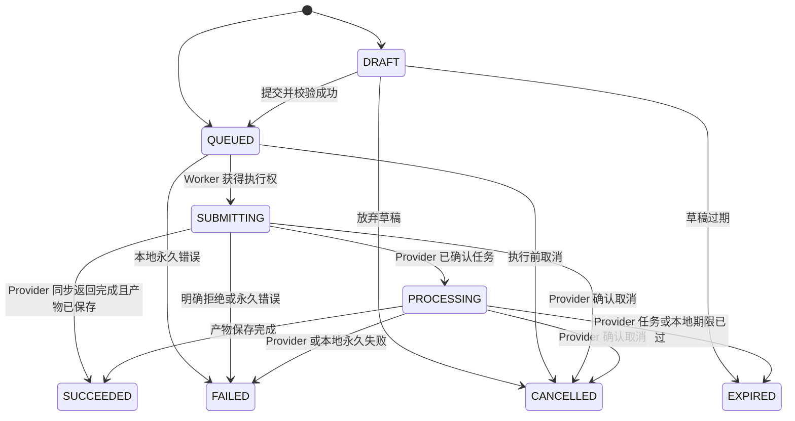

# 视频任务状态机

## 1. 设计原则

内部状态与 Provider 状态解耦。数据库、API 和 UI 只使用本文状态；Provider 的原始状态只能由适配器通过 `normalizeStatus()` 映射。状态只能单向推进，任何重试都不得把终态改回处理中。

## 2. 状态定义

| 状态         | 含义                                                | 是否终态 |
| ------------ | --------------------------------------------------- | -------- |
| `DRAFT`      | 已保存但尚未提交的草稿；MVP 可不提供草稿 UI         | 否       |
| `QUEUED`     | 已通过校验并持久化，等待 Worker                     | 否       |
| `SUBMITTING` | Worker 正在向 Provider 创建任务，或创建结果尚待确认 | 否       |
| `PROCESSING` | Provider 已确认接收并正在处理                       | 否       |
| `SUCCEEDED`  | Provider 成功，输出文件已安全保存且数据库已提交     | 是       |
| `FAILED`     | 发生不可恢复错误，已保存可展示的失败信息            | 是       |
| `CANCELLED`  | 未开始任务被本地取消，或 Provider 已确认取消        | 是       |
| `EXPIRED`    | 超过保留/处理期限，无法再获得有效结果               | 是       |

`SUCCEEDED` 必须表示产物已经写入本地 Storage，而不只是 Provider 报告成功。下载产物失败时任务保持 `PROCESSING` 并进行受控恢复；达到明确重试上限后转 `FAILED`。

## 3. 允许的流转

除图中流转外，其余更新均拒绝。终态不允许转出；“重试失败任务”应创建新任务，并用可选的 `retryOfTaskId` 关联，而不是复活原任务。

## 4. 状态写入规则

- 每次流转必须以数据库条件更新实现，例如仅当当前状态为 `QUEUED` 时写入 `SUBMITTING`。
- `VideoTask` 更新与对应 `TaskEvent` 插入必须处于同一事务。
- `providerTaskId` 一旦写入不得被另一个值覆盖。
- `progress` 是可选的 `0..100` 展示值；只有 Provider 明确返回且适配器可可靠映射时才更新，不根据耗时猜测。
- `errorCode` 使用稳定内部代码，`errorMessage` 为脱敏后的用户可读信息；原始异常只进入受控结构化日志。
- Worker 为终态任务收到重复 Job 时应无操作成功。

## 5. 创建请求结果不明

若创建 Provider 任务时连接超时，不能据此判断创建失败。任务保持 `SUBMITTING`，记录 `PROVIDER_CREATE_OUTCOME_UNKNOWN` 事件：

- Provider 明确支持幂等键或按客户端请求 ID 查询时，按文档协调。
- Provider 不支持上述能力时，不自动重发创建请求，避免重复计费和重复生成；等待人工处理或明确的超时策略。
- Mock Provider 必须支持客户端请求 ID 幂等，以验证恢复流程。

具体策略在拿到 `docs/provider-api.md` 后确认。

## 6. 轮询、重试与取消

- 轮询间隔采用有上限的退避并加入抖动，具体数值由运行配置决定。
- HTTP 超时、限流和部分服务端错误是否可重试，由适配器分类；参数错误、认证错误等直接失败。
- 重试次数是执行元数据，不是业务状态；暂时性失败不来回切换状态。
- 只有 Provider 明确支持取消且返回确认后，`SUBMITTING/PROCESSING` 才进入 `CANCELLED`。否则接口返回“不支持”，不能假装取消成功。

## 7. Mock Provider 场景

Mock Provider 使用显式测试场景控制结果，不借用或伪造真实 Seedance 参数：

- `success`：经过至少一次查询后成功并返回固定测试视频。
- `failure`：返回稳定的测试错误码与脱敏消息。
- `slow`：保持处理中，便于验证轮询和重启恢复。

场景选择应仅在开发/测试环境通过内部测试配置暴露，生产 UI 不展示这些控制项。
